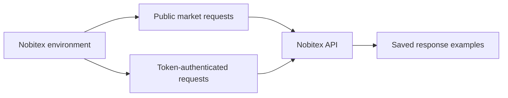

# Nobitex API Postman Collection

This repository contains a comprehensive Postman collection for interacting with the [Nobitex API](https://apidocs.nobitex.ir), 
the leading cryptocurrency exchange API in Iran. The collection includes requests for major endpoints, organized by category, 
to help you quickly explore and integrate Nobitex's API into your projects.

## At a Glance

| Item | Included |
|---|---|
| Configured requests | 56 |
| Saved response examples | 121 |
| Top-level folders | 11 |
| Coverage | Markets, authentication, users, wallets, spot/commitment trading, withdrawals, referrals, and security |
| Authentication | Environment-based `Authorization: Token` header |

## Table of Contents
- [Overview](#overview)
- [Nobitex API Details](#nobitex-api-details)
- [Getting Started](#getting-started)
- [Using the Postman Collection](#using-the-postman-collection)
- [Available Endpoints](#available-endpoints)
- [Contributing](#contributing)
- [License](#license)
- [Resources](#resources)

## Overview
The Nobitex API provides access to real-time and historical cryptocurrency data, 
including order books, trades, market statistics, user wallets, deposits, withdrawals, and trading actions. 
This repository includes a Postman collection (`Nobitex.postman_collection.json`) and a companion
`Nobitex.postman_environment.json`, covering all major public and private endpoints of the Nobitex API,
making it easy to test and integrate into your applications.

## Nobitex API Details
- **Base URL**: `https://api.nobitex.ir`
- **Authentication**: Private endpoints require an `Authorization: Token {{token}}` header.
- **Documentation**: [Official Nobitex API Docs](https://apidocs.nobitex.ir)
- **Rate Limits**:
    - Public Market Data: ~60 requests/minute (varies by endpoint)
    - Authenticated User Data & Trading: Stricter limits apply

> **Note**: You need to generate an API token from your Nobitex account dashboard to use private endpoints.
> This kit never ships a real token — `token` in the environment file is intentionally blank.

## Getting Started
### Prerequisites
- [Postman](https://www.postman.com/downloads/) installed to use the collection.
- A Nobitex account and API token for private endpoints.

### Installation
1. Import both files into Postman:
   - `Nobitex.postman_collection.json`
   - `Nobitex.postman_environment.json`
2. Select the **Nobitex API** environment in Postman.
3. Set `token` to your generated Nobitex API token.

## Auth Automation
Every private request already carries header `Authorization: Token {{token}}`,
resolved directly from the environment — no pre-request script is needed.
Public market-data requests work with no token set at all.

## Using the Postman Collection
The Postman collection is organized into folders by endpoint categories (e.g., Public Market Data, Accounts, Orders, Wallets). Each request includes:
- A description of its purpose.
- Pre-configured path/query parameters (e.g., `:symbol`, `limit`).
- The base URL (`{{base_url}}`, default `https://api.nobitex.ir`).

### Example Usage
1. **Get Orderbook**:
    - Use `/v3/orderbook/:symbol` to retrieve the order book for a specific trading pair (e.g., `BTCIRT`).
2. **Get Recent Trades**:
    - Use `/v2/trades/:symbol` to fetch the latest trades for a market.
3. **Check Wallet Balance**:
    - Use `/users/wallets/list` to see your wallet balances (requires authentication).
4. **Place a New Order**:
    - Use `/market/orders/add` to submit a buy/sell order (requires authentication).

## Available Endpoints
The Postman collection is organized into these top-level folders:

- **Public Market Data**: Orderbook, Trades, Stats, OHLC, Global Stats
- **Authentication**: Login, Logout, Login Attempts
- **User Info**: Profile, Limitations
- **Wallet Operations**: Wallets, Transactions, Deposits
- **Trade in Spot Market**: Add Order, Orders List, Order Status, Cancel Orders, User Trades
- **Trade in Commitment Market**: Market List, Pools, Transfer Funds, Open/Close Positions
- **Withdraw**: Create Withdrawal, Confirm Withdrawal, List Withdrawals, Bank Card/Account setup
- **Referral Join**: Referral program endpoints
- **Address Book and Whitelist Mode**: Address Book CRUD, Safe Withdrawals
- **profit**: Profit/yield-related endpoints
- **Security**: Anti-Phishing and account security endpoints

For detailed endpoint descriptions, refer to the [Nobitex API Documentation](https://apidocs.nobitex.ir).

## Project Status

The collection, environment, and 121 saved examples validate successfully as
JSON. Credential fields ship empty. Trading, withdrawal, and account-security
requests can change real assets or account state; review every parameter and
use a least-privilege token.

This repository is part of the
[Crypto API Postman toolkit](https://github.com/nima-mokhtarian?tab=repositories).

## Contributing
Contributions are welcome! To contribute:
1. Fork the repository.
2. Create a new branch (`git checkout -b feature/your-feature`).
3. Add or update requests in the Postman collection.
4. Update the README if necessary.
5. Submit a merge request with a clear description of changes.

Please ensure your changes align with the Nobitex API documentation and test all requests before submitting.

## License
This project is licensed under the MIT License. See the [LICENSE](LICENSE) file for details.

## Resources
- [Nobitex API Documentation](https://apidocs.nobitex.ir)
- [Postman Documentation](https://learning.postman.com/docs/getting-started/introduction/)
- [Git Documentation](https://git-scm.com/doc)
